# 概要
ゲームの楽しみの一つはスコアを競う事です。
今回は、得点計算をして、得点を表示しましょう。

https://user-images.githubusercontent.com/936545/155356011-45ad2eb4-89e3-4c6e-a00e-80a887e77f40.mp4

# 手順

やることは2つです。
- 得点の表示
- 得点の計算

## 得点の表示
### オブジェクトの配置

まずは得点を表示できるようにしましょう。
テキストの表示には、TextMeshProのゲームオブジェクトを使います。
Hierarchyウィンドウを右クリックして、「UI」の「Canvas」を追加してください。
このキャンバスですが、もしかしたら、追加した時にカメラが追加されるかもしれません。今回は、最初から追加されているメインカメラを使うので、既にあるBoardの下にCanvasを移動して、追加されたカメラは削除して問題ありません。（下の画像は、Canvasを追加した後にCanvasを追加しようとしていますが、これはメニューを見せるためで、Canvasの追加前にCanvasのゲームオブジェクトはありません。以下のTextMeshProオブジェクトも同様です）

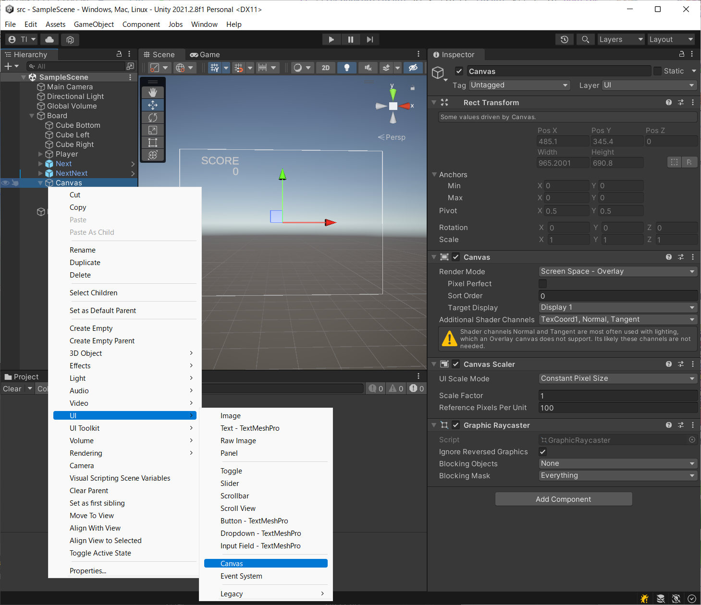

Canvasを追加したら文字表示用のTextMeshProオブジェクトを配置します。
Hierarchyウィンドウから、「UI」-「Text-TextMeshPro」を選択して、Textオブジェクトを追加して下さい。
TextMeshProを初めて使う場合は、パッケージのインストールが入るかもしれません。

今回は、得点自体を表示するオブジェクト(Score)と、「SCORE」と表示する静的なテキストの「Text(TMP)」を追加します。

その後、インスペクターでいくつかの設定を行います。
「Score」ゲームーオブジェクトであれば、次のように設定します（好みで調整してください）。

- Rect Transform: 位置の設定
  - アンカーポイント(Anchorsと書かれている上の図): top-leftに設定
  - PosX, PosY: (175, -100)などと左上からの位置を設定
  - Width, Height: 大きな数字でも桁が収まる大きさを設定
- TextMeshPro - Text (UI)
  - テキストの文章：0
  - Font Size: 50など好きな大きさに設定

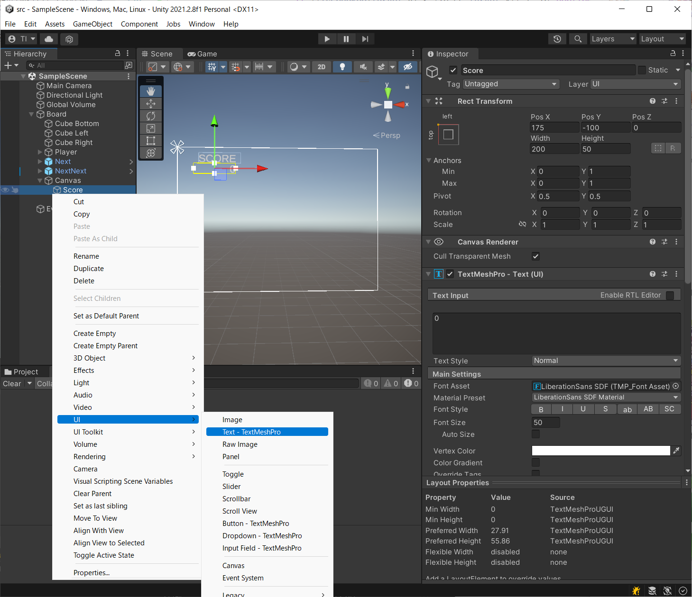

静的テキストも同様に設定します。
- Rect Transform: 位置の設定
  - アンカーポイント(Anchorsと書かれている上の図): top-leftに設定
  - PosX, PosY: (200, -50)などと左上からの位置を設定
  - Width, Height: 「SCORE」が表示できる大きさを設定
- TextMeshPro - Text (UI)
  - テキストの文章：SCORE
  - Font Size: 50など好きな大きさに設定

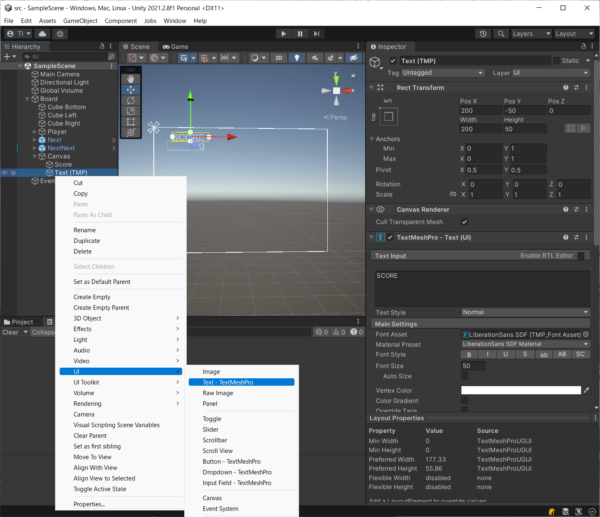

### コードからゲーム画面の表示の変更

次に、コードから得点表示を変えられるようにしましょう。
ゲームの流れは、PlayDirector が制御しているので、
PlayDirector が得点の更新を行うのが良さそうです。
という事で、PlayDirectorのメンバーに TextMeshProGUI を
追加します(38行目)。メンバーは、インスペクターから設定するように、SerializedFieldの属性をつけておきます。

なお、その他のメンバーとして、得点を保持する「_score」と
連鎖を管理する「_chainCount」も追加しておきます(39, 40行目)。
「_chainCount」は、後から出てきます。

得点を設定するメソッドとして、「SetScore」を用意します(194-198行目)。
ここで、TextMeshProGUI のメンバーの text プロパティに
文字列を設定すれば、画面中のテキストが更新されます(197行目)。

あと、実際には、現在のスコアに得点を追加する計算がほとんどなので、追加する得点を受け取る AddScore メソッドを用意しておきます。

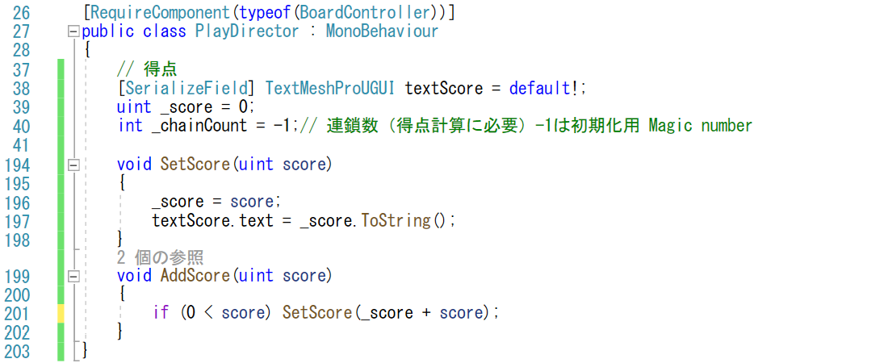

得点の数値を変えたくなりますが、まずは表示の変更を確認しましょう。
このままではプログラムは動きません。
BoardオブジェクトのPlayDirectorスクリプトに
新たに追加された項目「Text Score」に、先ほど作成した、
「Score」ゲームオブジェクトをドラッグアンドドロップしてください。

これで、プログラムを動かすと、画面の左上にスコアが表示されるはずです。

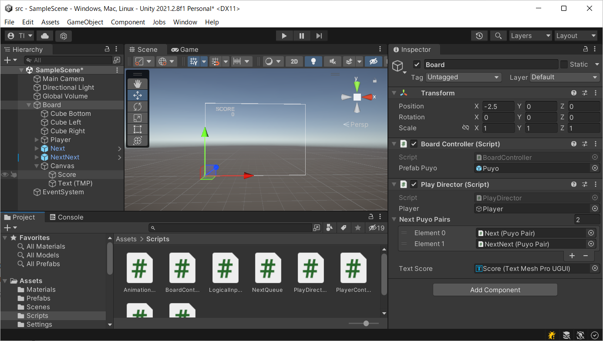

## 得点の計算
では、得点計算を行って、プレイに応じてスコアを更新していきましょう。

## PlayDirector の修正

先ほど修正した PlayDirector ですが、更新する SetScore メソッドは作りましたが、まだメソッドを呼び出す処理を書いていません。

色々な得点の追加方法がありますが、今回は、他のスクリプトから、
適当なタイミングで増えた得点を取得するようにしたいと思います。

具体的には、PlayerController や BoardController が管理している情報で得点が追加されるので、これらのスクリプトから、
追加された得点を取得するようにします。

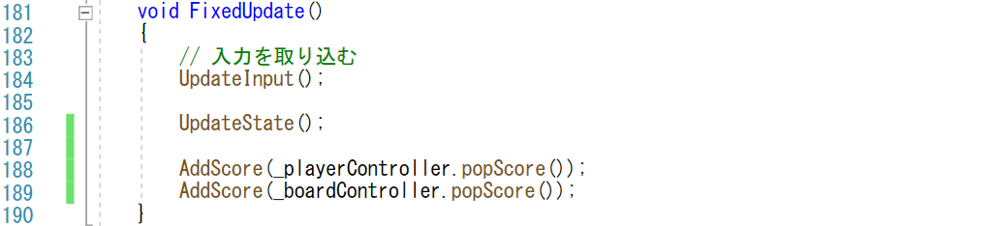

この popScore メソッドですが、BoardController ならば、
追加された得点を保持するメンバー _additiveScore を
用意しておいて(29行目)、popScoreが呼ばれたタイミングで、
それまでに蓄積された値(276行目)を返すと共に、_additiveScore を0リセットします(277行目)。

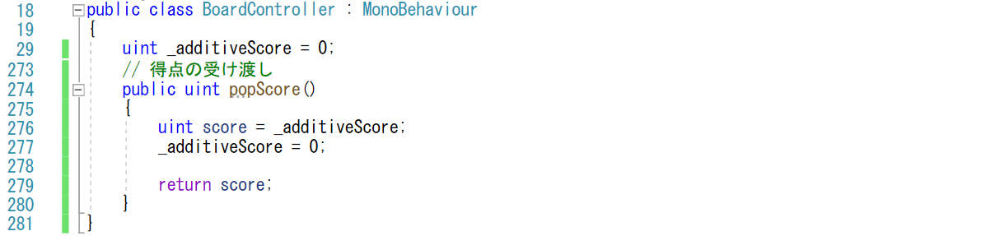

## PlayerController の修正

後は、AddScore に与える値を計算するだけです。
簡単な方で、PlayerController を実装していきます。

PlayerController で考えるスコアは「落下ボーナス」です。
キーを下に入れると、ぷよぷよが高速に落ちてきますが、
この時に、同時に得点も入ります。
逆に言うと、それしか関係なので、PlayerController の
popScore は、高速落下したボーナスを提供します(293-299行目)。PlayerController でも、_additiveScore メンバーを追加して、
それまでに蓄積されたボーナスを受け渡して行きます。
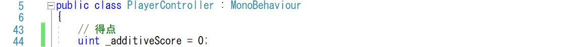
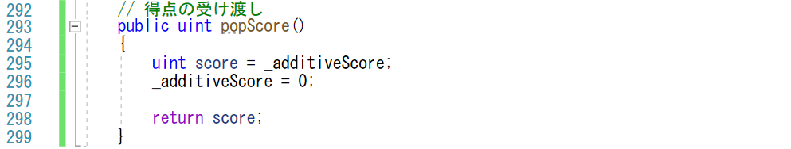

落下ボーナスのスコアは、下に入れた時に追加されます。
地面等に設置している場合に下にいれていても速くは動かないので、ボーナスを入れないように気をつけなくてはなりません。
これに一番良いのは、Fall メソッドです。
Fall メソッドは、下にキーを入れたのかどうかを引数で受け取り、
固定されたら処理の途中で早期リターンされるので、
メソッドの最後にボーナスを追加すれば、キーを下に入れて高速に移動した時を判定できます(216行目)。

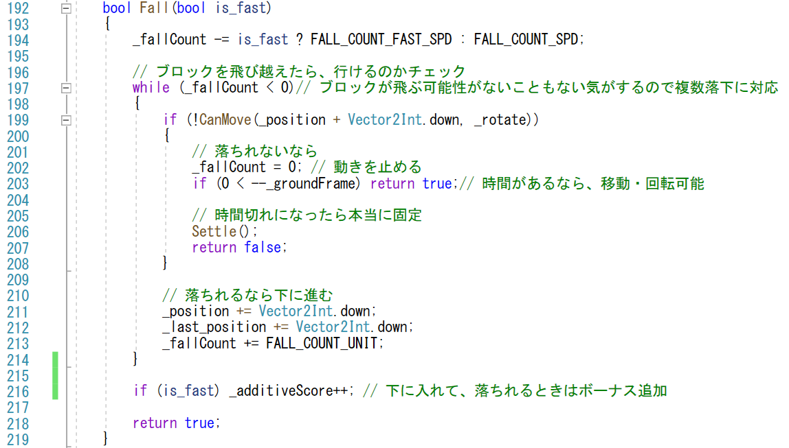

## BoardController の修正

次は、BoardController に関係する得点計算です。
BoardController が得点計算するのは、ぷよが消える時、
CheckErase メソッドを呼び出す時となります。
なお、得点計算では、ぷよが消えて落ちた後にまたぷよが消える連鎖の数が必要になってくるので、連鎖の値 _chainCount を引数に追加します(141行目)。

_chainCount は、消すぷよがあれば ErasingState に入ってくるたびに増えて、消すぷよがなければ0にリセットします。

なお、一番最初のぷよがない状態で、全消しのボーナス得点が入らないように、_chainCount は、特別な値(-1)で初期化しています(既出40行目)。
この-1はマジックナンバーなので、長期的な視点では、もっときれいな処理に書き換えておく方がよいでしょう。

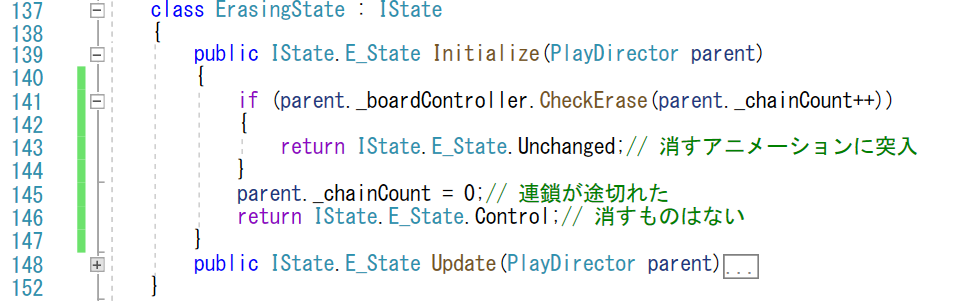

それでは、実際の消した時の得点計算です。
BoardController の CheckErase で計算します。
消した際の得点はネットを調べると出てきます。
たとえば、「[得点計算-ぷよぷよ用語辞典
](https://w.atwiki.jp/puyowords/pages/122.html)」にあります。

ぷよぷよの得点は、次の式で求められます。

- 消したぷよの個数×(連鎖ボーナス＋連結ボーナス＋色数ボーナス)×10

但し、括弧の中のボーナスの和が0の時は、1として処理されます(233行目)。

これら、ボーナスの値は、それぞれのボーナスの元の値毎に値が決められています。今回は、これらの値を配列(150-162行目)としてテーブル引きします。

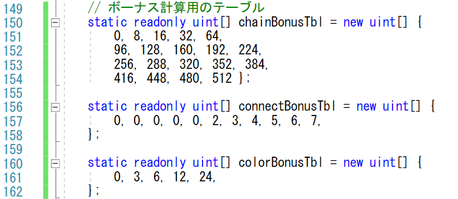

後は、それぞれのボーナスの元になる値を計算します。

- 消したぷよの個数
  - _erase に消えたぷよが入っているので、個数は _erase.Count で取得できます。
- 連鎖ボーナス
  - 連鎖数を使います。連鎖数は、CheckErase の引数(166行目)で入ってくるので、これを用います。連鎖ボーナスは上限が決まっており、それ以上の連鎖をしてもボーナスは増えません。従って、連鎖ボーナスのテーブル数を上限としてテーブル chainBonusTbl を参照します(232行目)。
- 連結ボーナス
  - 連結数は、ぷよがつながった数に応じたボーナスです。一度に何個も消えるので、それぞれの個数ごとにボーナスが入ります。それぞれのぷよの個数は、get_connection を呼び出した後のadd_listの要素数なので、この要素数が4以上の消える場合に、ボーナスを追加しておきます(215行目)。
- 色数ボーナス
  - 色数ボーナスは、一度消したぷよの色数に応じたボーナスです。消したぷよの種類をフラグ管理します。colorBit という変数を用意して(175行目)、消えたぷよに関して、その種類のフラグを立てていきます(216行目)。消えるぷよを調べ終わった後に、立っているビット数を計算します(225-229行目)。立ったビット数 colorNum がテーブル引きする変数です。念のため、最大数のキャップをしてテーブルを参照します(231行目)。

あと、全てのぷよが消えた際の「全消し」ボーナスがあります。
これは、「puyoCount」という変数を用意しておいて(174行目)、くなんらかのぷよがいたら、数を増やします(190行目)。消すよを計算した後に、まったくぷよがいなかった場合に、全消しボーナスを追加します(236行目)。

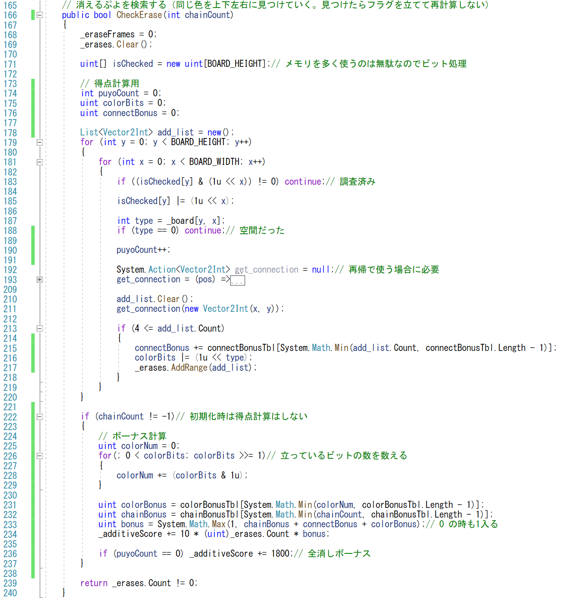

# 検証

ゲームをプレイして得点が入れば正解です。
全消しや、下に早く落とした時、連鎖、長くつなげたり、同時消しの得点の違いを感じてみましょう。
